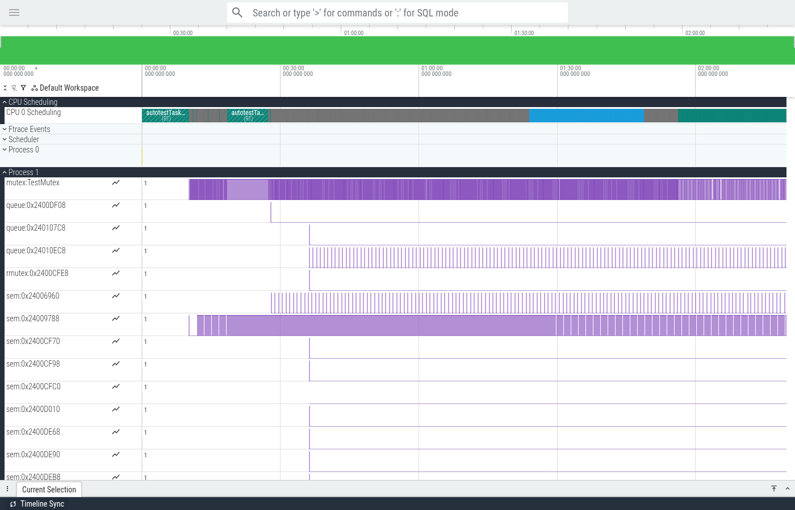
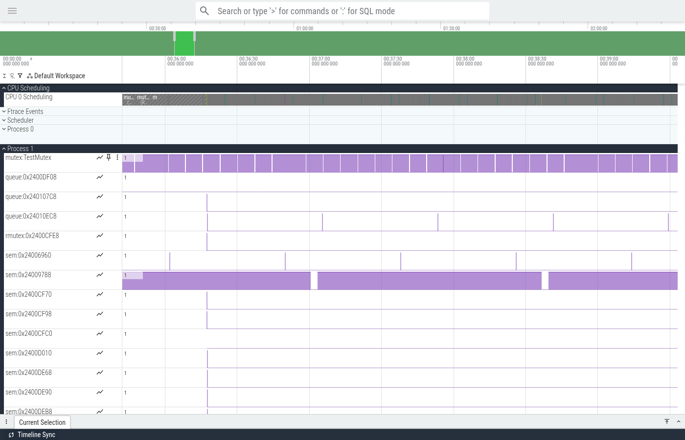
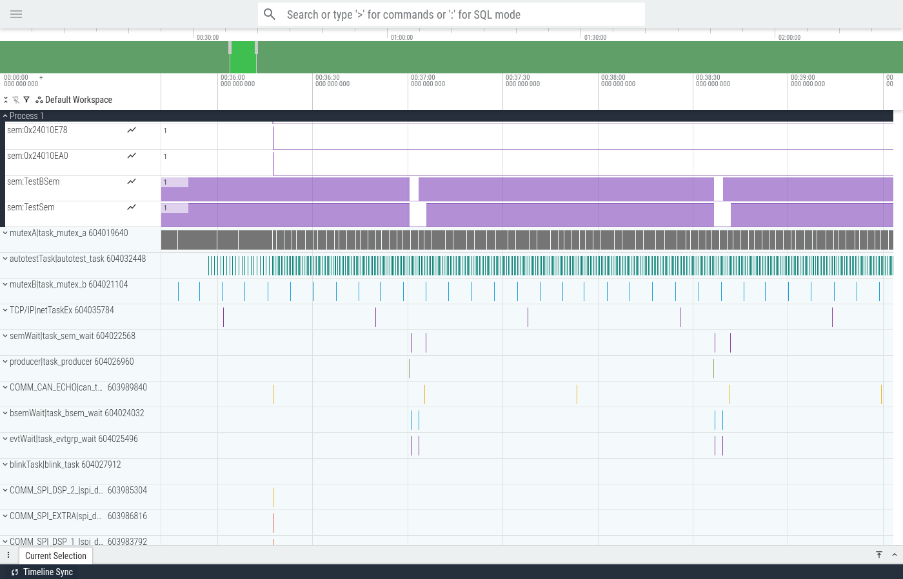
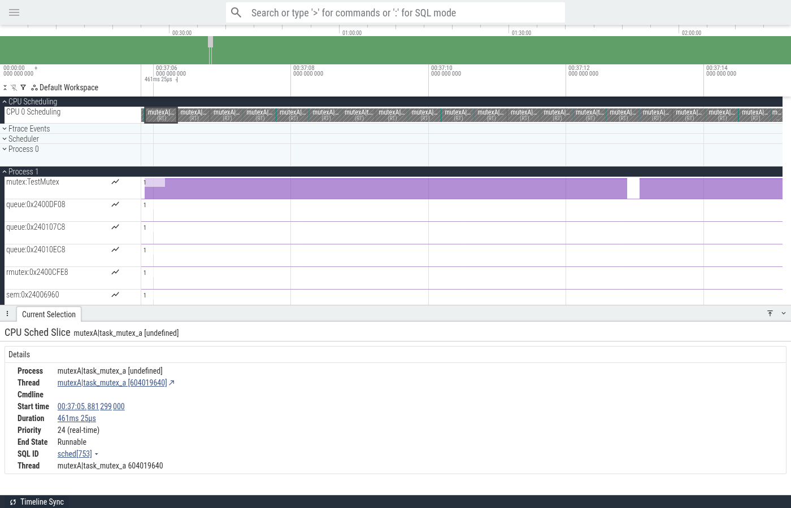
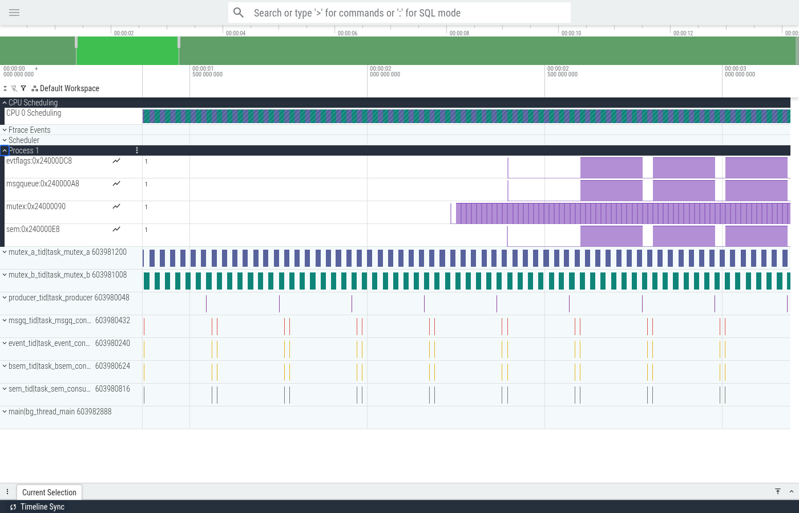

# Ftrace Output Reference

`orbtop-rtos -K trace.ftrace` writes a Linux ftrace-compatible file.
[Perfetto](https://ui.perfetto.dev) can load it directly.
TraceCompass requires the ftrace plugin
(see [TraceCompass Compatibility](#tracecompass-compatibility)).

## File Format

### Header

The file uses the standard [Linux kernel ftrace](https://www.kernel.org/doc/html/latest/trace/ftrace.html) text format header.

```
# tracer: nop
#
# entries-in-buffer/entries-written: 0/0   #P:1
#
#                                _-----=> irqs-off
#                               / _----=> need-resched
#                              | / _---=> hardirq/softirq
#                              || / _--=> preempt-depth
#                              ||| /     delay
#           TASK-PID     CPU#  ||||   TIMESTAMP  FUNCTION
#              | |         |   ||||      |         |
```

| Line | Meaning |
|------|---------|
| `# tracer: nop` | Tracer type. `nop` means event-only mode (no function tracer). |
| `entries-in-buffer/entries-written: 0/0` | Ring buffer statistics. Always `0/0` here (not a kernel ring buffer). |
| `#P:1` | Number of CPUs. Always `1` (single-core Cortex-M). |
| Column header lines | Define the event line format. The `||||` flags (irqs-off, need-resched, etc.) are always `....` in our output (not applicable to bare-metal). |

### Event Types

The file contains three event types:

| Event | Description | Hardware source | Option |
|-------|-------------|-----------------|--------|
| `sched_switch` | RTOS context switch between threads. Records prev/next thread name, priority, and scheduling state (R/S/D). | DWT comparator 0 on current-thread-pointer variable | always (with `-K`) |
| `tracing_mark_write: C\|1\|...` | Kernel object blocking event. Records which mutex, semaphore, queue, or event a thread is waiting on. Appears as a counter track in Perfetto. | DWT comparator 2 on `rtos_obj_trace` variable | `-w` |
| `tracing_mark_write: C\|0\|...` | Firmware-defined ITM stimulus channel value. Records arbitrary 32-bit values written by firmware to ITM stimulus ports. Appears as a counter track in Perfetto. | ITM stimulus port writes | `-c` |

---

## 1. sched_switch

Generated on every RTOS context switch detected via DWT comparator 0.

**Format:**
```
   <prev_name>-<pid> [000] .... <timestamp>: sched_switch: prev_comm=<name> prev_pid=<pid> prev_prio=<prio> prev_state=<state> ==> next_comm=<name> next_pid=<pid> next_prio=<prio>
```

**Fields:**

| Field | Value | Source |
|-------|-------|--------|
| `prev_comm` / `next_comm` | `ThreadName\|entry_function` | RTOS thread info via telnet |
| `prev_pid` / `next_pid` | TCB/thread address | DWT comp0 value |
| `prev_prio` / `next_prio` | Thread priority | RTOS thread info |
| `prev_state` | `R`, `S`, or `D` | See below |

### prev_state Values

| State | Meaning | Perfetto shows | Trigger |
|-------|---------|----------------|---------|
| `R` | Runnable (preempted) | "End State: Runnable" | Higher priority thread ran |
| `S` | Sleeping (voluntary delay) | "End State: Sleeping" | `k_sleep`, `osDelay`, `vTaskDelay` |
| `D` | Blocked on kernel object | "End State: Uninterruptible Sleep" | Mutex, semaphore, queue, event |

State `D` requires the `-w` option (DWT comp2 watchpoint on `rtos_obj_trace`).
Without `-w`, all switches show `R` (no way to distinguish blocked vs preempted).

### Real Examples

**FreeRTOS** — preempted by higher priority (R):
```
mutexA|task_mutex_a-604019640 [000] ....  1668.583580: sched_switch: prev_comm=mutexA|task_mutex_a prev_pid=604019640 prev_prio=24 prev_state=R ==> next_comm=autotestTask|autotest_task next_pid=604032448 next_prio=25
```

**FreeRTOS** — sleeping after `vTaskDelay` (S):
```
blinkTask|blink_task-604027912 [000] ....   614.533882: sched_switch: prev_comm=blinkTask|blink_task prev_pid=604027912 prev_prio=24 prev_state=S ==> next_comm=mutexA|task_mutex_a next_pid=604019640 next_prio=24
```

**FreeRTOS** — blocked on mutex (D):
```
mutexB|task_mutex_b-604021104 [000] ....   614.510154: sched_switch: prev_comm=mutexB|task_mutex_b prev_pid=604021104 prev_prio=24 prev_state=D ==> next_comm=semWait|task_sem_wait next_pid=604022568 next_prio=24
```

**Zephyr** — preempted, round-robin (R):
```
mutex_a_tid|task_mutex_a-603981200 [000] ....     0.116787: sched_switch: prev_comm=mutex_a_tid|task_mutex_a prev_pid=603981200 prev_prio=5 prev_state=R ==> next_comm=producer_tid|task_producer next_pid=603980048 next_prio=5
```

**Zephyr** — sleeping after `k_sleep` (S):
```
producer_tid|task_producer-603980048 [000] ....     2.366437: sched_switch: prev_comm=producer_tid|task_producer prev_pid=603980048 prev_prio=5 prev_state=S ==> next_comm=mutex_b_tid|task_mutex_b next_pid=603981008 next_prio=5
```

**Zephyr** — blocked on mutex (D):
```
mutex_b_tid|task_mutex_b-603981008 [000] ....     2.235023: sched_switch: prev_comm=mutex_b_tid|task_mutex_b prev_pid=603981008 prev_prio=5 prev_state=D ==> next_comm=mutex_a_tid|task_mutex_a next_pid=603981200 next_prio=5
```

---

## 2. Object Tracking Events (tracing_mark_write C|1|...)

Generated when a thread blocks on (or is released from) an RTOS kernel object.
Requires `-w rtos_obj_trace`.

**Format:**
```
        rtos_obj-1 [000] .... <timestamp>: tracing_mark_write: C|1|<type>:<name>|<value>
```

- `value=1` = thread just blocked on this object
- `value=0` = thread released (object event ended)

### Object Type Prefixes

| Prefix | FreeRTOS | RTX5 | Zephyr |
|--------|----------|------|--------|
| `mutex` | Mutex (ucQueueType=1) | Mutex (ID=0xF5) | k_mutex (tag 00) |
| `rmutex` | Recursive mutex (ucQueueType=4) | -- | -- |
| `sem` | Counting/binary sem (ucQueueType=2,3) | Semaphore (ID=0xF6) | k_sem (tag 01) |
| `queue` | Queue (ucQueueType=0) | Message Queue (ID=0xFA) | -- |
| `msgqueue` | -- | Message Queue (ID=0xFA) | k_msgq (tag 10) |
| `evtflags` | EventGroup_t (bit0 tag) | Event Flags (ID=0xF3) | k_event (tag 11) |
| `mempool` | -- | Memory Pool (ID=0xF7) | -- |

### Naming

- **FreeRTOS**: Named via `vQueueAddToRegistry()` (e.g. `mutex:TestMutex`).
  Unregistered objects show hex address: `sem:0x24006960`.
  EventGroups always show hex (no registry).
- **RTX5**: Named from control block name pointer (e.g. `mutex:MyMutex`).
- **Zephyr**: Always hex address (e.g. `mutex:0x24000090`).
  Zephyr kernel objects have no name fields.

### Real Examples — Acquire/Release Pairs

**FreeRTOS** — mutex (named via `vQueueAddToRegistry`):
```
        rtos_obj-1 [000] ....   621.705868: tracing_mark_write: C|1|mutex:TestMutex|1
        rtos_obj-1 [000] ....   628.464283: tracing_mark_write: C|1|mutex:TestMutex|0
```

**FreeRTOS** — semaphore (named):
```
        rtos_obj-1 [000] ....   614.512741: tracing_mark_write: C|1|sem:TestSem|1
        rtos_obj-1 [000] ....   614.516284: tracing_mark_write: C|1|sem:TestSem|0
```

**FreeRTOS** — binary semaphore (named):
```
        rtos_obj-1 [000] ....   614.518883: tracing_mark_write: C|1|sem:TestBSem|1
        rtos_obj-1 [000] ....   614.522390: tracing_mark_write: C|1|sem:TestBSem|0
```

**FreeRTOS** — queue (unnamed):
```
        rtos_obj-1 [000] ....  1677.526053: tracing_mark_write: C|1|queue:0x2400DF08|1
        rtos_obj-1 [000] ....  1677.527760: tracing_mark_write: C|1|queue:0x2400DF08|0
```

**FreeRTOS** — recursive mutex (unnamed):
```
        rtos_obj-1 [000] ....  2177.550138: tracing_mark_write: C|1|rmutex:0x2400CFE8|1
        rtos_obj-1 [000] ....  2177.550138: tracing_mark_write: C|1|rmutex:0x2400CFE8|0
```

**Zephyr** — mutex (hex address):
```
        rtos_obj-1 [000] ....     2.235014: tracing_mark_write: C|1|mutex:0x24000090|1
        rtos_obj-1 [000] ....     2.235023: tracing_mark_write: C|1|mutex:0x24000090|0
```

**Zephyr** — semaphore:
```
        rtos_obj-1 [000] ....     2.600209: tracing_mark_write: C|1|sem:0x240000E8|1
        rtos_obj-1 [000] ....     2.775444: tracing_mark_write: C|1|sem:0x240000E8|0
```

**Zephyr** — event flags:
```
        rtos_obj-1 [000] ....     2.395712: tracing_mark_write: C|1|evtflags:0x24000DC8|1
        rtos_obj-1 [000] ....     2.395721: tracing_mark_write: C|1|evtflags:0x24000DC8|0
```

**Zephyr** — message queue:
```
        rtos_obj-1 [000] ....     2.600233: tracing_mark_write: C|1|msgqueue:0x240000A8|1
        rtos_obj-1 [000] ....     2.775439: tracing_mark_write: C|1|msgqueue:0x240000A8|0
```

---

## 3. ITM Stimulus Channel Events (tracing_mark_write C|0|...)

Generated when firmware writes to an ITM stimulus port.
Requires `-c <channels>` (e.g. `-c 1-31:signal_`).

**Format:**
```
           <...>-0 [000] .... <timestamp>: tracing_mark_write: C|0|<tag>|<value>
```

The `<tag>` is `<prefix><channel>` (e.g. `signal_1`, `signal_31`).
The `<value>` is the 32-bit word written to the stimulus register.

### Real Example

**FreeRTOS** — burst of ITM stimulus channels (31 signals):
```
           <...>-0 [000] ....  1094.505372: tracing_mark_write: C|0|signal_1|45
           <...>-0 [000] ....  1094.505667: tracing_mark_write: C|0|signal_2|207
           <...>-0 [000] ....  1094.505954: tracing_mark_write: C|0|signal_3|70
```

---

## Firmware Hooks

### FreeRTOS

Add to `FreeRTOSConfig.h`:

```c
extern volatile uint32_t rtos_obj_trace;

/* Queue-based objects (mutex, semaphore, queue) */
#define traceBLOCKING_ON_QUEUE_RECEIVE(pxQueue)   do { rtos_obj_trace = (uint32_t)(pxQueue); } while(0)
#define traceBLOCKING_ON_QUEUE_SEND(pxQueue)      do { rtos_obj_trace = (uint32_t)(pxQueue); } while(0)

/* Event Groups (bit0=1 to distinguish from Queue_t) */
#define traceEVENT_GROUP_WAIT_BITS_BLOCK(xEG, uxBits)           do { rtos_obj_trace = (uint32_t)(xEG) | 1u; } while(0)
#define traceEVENT_GROUP_SYNC_BLOCK(xEG, uxSet, uxWait)         do { rtos_obj_trace = (uint32_t)(xEG) | 1u; } while(0)

/* Delays (prev_state=S) */
#define traceTASK_DELAY()          do { rtos_obj_trace = 0; } while(0)
#define traceTASK_DELAY_UNTIL(x)   do { rtos_obj_trace = 0; } while(0)
```

Requirements:
- `configUSE_TRACE_FACILITY = 1` (enables `ucQueueType` for type detection)
- `configQUEUE_REGISTRY_SIZE > 0` (enables name lookup)
- Register objects: `vQueueAddToRegistry(myMutex, "TestMutex")`

### RTX5

Create `rtos_obj_trace.c` with weak EvrRtx callbacks:

```c
volatile uint32_t rtos_obj_trace;

void EvrRtxMutexAcquirePending(void *id, uint32_t timeout)         { rtos_obj_trace = (uint32_t)id; }
void EvrRtxSemaphoreAcquirePending(void *id, uint32_t timeout)     { rtos_obj_trace = (uint32_t)id; }
void EvrRtxEventFlagsWaitPending(void *id, uint32_t f, uint32_t o, uint32_t t)  { rtos_obj_trace = (uint32_t)id; }
void EvrRtxMessageQueueGetPending(void *id, void *m, uint32_t t)   { rtos_obj_trace = (uint32_t)id; }
void EvrRtxMessageQueuePutPending(void *id, const void *m, uint32_t t) { rtos_obj_trace = (uint32_t)id; }
void EvrRtxMemoryPoolAllocPending(void *id, uint32_t timeout)      { rtos_obj_trace = (uint32_t)id; }
void EvrRtxDelay(uint32_t ticks)      { rtos_obj_trace = 0; }
void EvrRtxDelayUntil(uint32_t ticks) { rtos_obj_trace = 0; }
```

### Zephyr

Override `sys_port_trace_*_blocking` macros via `#include_next` wrapper
(see [zephyr-object-tracking.md](../zephyr/zephyr-object-tracking.md) for full details):

```c
extern volatile uint32_t rtos_obj_trace;

#define ZEPHYR_OBJ_MUTEX  0u   /* bits [1:0] = 00 */
#define ZEPHYR_OBJ_SEM    1u   /* bits [1:0] = 01 */
#define ZEPHYR_OBJ_MSGQ   2u   /* bits [1:0] = 10 */
#define ZEPHYR_OBJ_EVENT  3u   /* bits [1:0] = 11 */

#define sys_port_trace_k_mutex_lock_blocking(mutex, timeout) \
    do { rtos_obj_trace = (uint32_t)(mutex) | ZEPHYR_OBJ_MUTEX; } while(0)
#define sys_port_trace_k_sem_take_blocking(sem, timeout) \
    do { rtos_obj_trace = (uint32_t)(sem) | ZEPHYR_OBJ_SEM; } while(0)
#define sys_port_trace_k_msgq_get_blocking(msgq, timeout) \
    do { rtos_obj_trace = (uint32_t)(msgq) | ZEPHYR_OBJ_MSGQ; } while(0)
#define sys_port_trace_k_msgq_put_blocking(msgq, timeout) \
    do { rtos_obj_trace = (uint32_t)(msgq) | ZEPHYR_OBJ_MSGQ; } while(0)
#define sys_port_trace_k_event_wait_blocking(event, events, options, timeout) \
    do { rtos_obj_trace = (uint32_t)(event) | ZEPHYR_OBJ_EVENT; } while(0)
#define sys_port_trace_k_thread_sleep_enter(timeout) \
    do { rtos_obj_trace = 0; } while(0)
```

Additional hooks (grouped under MSGQ tag 10):
`k_pipe` (`*_get_blocking`, `*_put_blocking`),
`k_mbox` (`*_message_put_blocking`, `*_message_get_blocking`),
`k_mem_slab` (`*_alloc_blocking`).

Additional hooks (grouped under EVENT tag 11):
`k_condvar` (`*_wait_blocking`).

Requires `CONFIG_TRACING=y` in `prj.conf`.

---

## Visualization in Perfetto

Open the `.ftrace` file at [ui.perfetto.dev](https://ui.perfetto.dev).

### Thread Timeline (sched_switch)

Each RTOS thread appears as a swim lane. Colored slices show execution periods.
The slice color encodes the **end state** of that execution period:

| Slice color | End state | Meaning |
|-------------|-----------|---------|
| Green/teal | Running | Thread was on CPU |
| Gray | Sleeping (S) | Thread called delay/sleep |
| Blue | Runnable (R) | Thread was preempted |
| Purple/dark | Uninterruptible Sleep (D) | Thread blocked on object |

Click a slice to see details including "End State", priority, and duration.

### FreeRTOS Example -- sched_switch + object tracking + ITM



Full trace overview: CPU scheduling track, 20+ object counter tracks under
Process 1 (`mutex:TestMutex`, `queue:*`, `rmutex:*`, `sem:*`), and thread
swim lanes below. Named objects use `vQueueAddToRegistry()` names.



Zoomed view (~3 min window) showing object blocking events. Counter tracks
show value=1 (purple bar) during blocking: `mutex:TestMutex` with periodic
contention, `sem:0x24009788` with long blocking periods, and `queue:0x24010EC8`
with rapid acquire/release cycles.



Thread swim lanes at the same zoom level. `sem:TestBSem` and `sem:TestSem`
counter tracks visible above, with `mutexA|task_mutex_a` (dense gray = nearly
always running), `autotestTask` (teal), `mutexB|task_mutex_b` (blue, intermittent).



Detail panel for a CPU Sched Slice: Thread `mutexA|task_mutex_a [604019640]`,
Priority 24 (real-time), Duration 461ms, End State shown. Click any scheduling
slice to inspect its process, thread, timing, and end state.

### Zephyr Example -- sched_switch + object tracking



Zephyr trace (~3s window) with all four object types under Process 1:
`mutex:0x24000090` (dense contention), `sem:0x240000E8`, `evtflags:0x24000DC8`,
`msgqueue:0x240000A8`. All names are hex addresses (Zephyr objects have no name
fields). Thread swim lanes show `mutex_a_tid`, `mutex_b_tid` (very active),
`producer_tid`, `msgq_tid`, `event_tid`, `bsem_tid`, `sem_tid`.

### Counter Track Groups

Object counters and ITM counters appear under separate process groups:

| Group | Track format | Content |
|-------|-------------|---------|
| Process 0 | `signal_<N>` | ITM stimulus channel values (`-c`) |
| Process 1 | `<type>:<name>` | Object blocking events (`-w`) |

Counter value `1` = thread is currently blocked.  Value `0` = released.

---

## TraceCompass Compatibility

TraceCompass requires the **"Trace Compass ftrace (Incubation)"** plugin
to parse ftrace files (Install > search "ftrace"). With the plugin,
`sched_switch` events appear in the Control Flow view.

`tracing_mark_write` events (object counters, ITM channels) are not
supported by the ftrace plugin and require a custom XML analysis module.
See the TraceCompass documentation on "XML analysis" for defining custom
state providers.

**Use [Perfetto](https://ui.perfetto.dev) for full visualization** —
it handles both `sched_switch` and `tracing_mark_write` counter tracks
natively.

---

## Command Line Reference

```bash
# Minimal: sched_switch only
orbtop-rtos -e firmware.elf -F 480000000 -T freertos -s localhost:3443 -K trace.ftrace

# Full: sched_switch + object tracking + ITM channels
orbtop-rtos -e firmware.elf -F 480000000 -T freertos \
    -w rtos_obj_trace \
    -c 1-31:signal_ \
    -s localhost:3443 \
    -K trace.ftrace
```

| Option | Description | Required |
|--------|-------------|----------|
| `-e <elf>` | ELF file (symbols + DWARF) | Always |
| `-F <hz>` | CPU frequency in Hz (for timestamps) | Always |
| `-T <rtos>` | RTOS plugin (`freertos`, `rtx5`, `zephyr`) | For `-K`, `-w`, `-c` |
| `-K <file>` | Ftrace output file (use `-` for stdout) | For `-w`, `-c` |
| `-w <symbol>` | Object tracking (D-state + counter tracks) | Optional |
| `-c <spec>` | ITM channel counter tracks | Optional |
