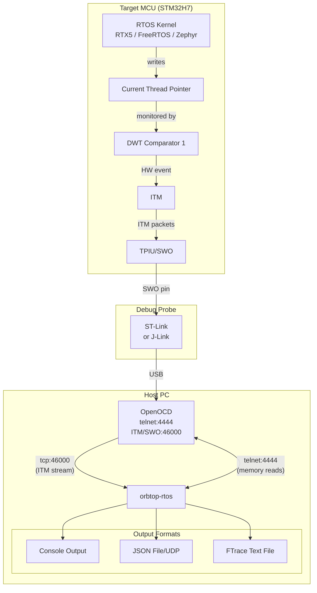
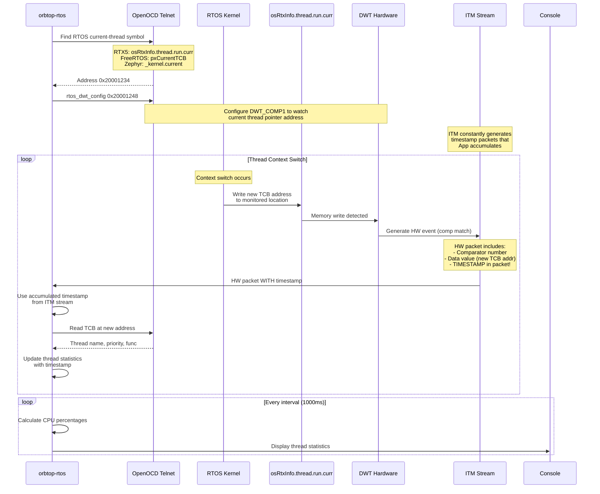
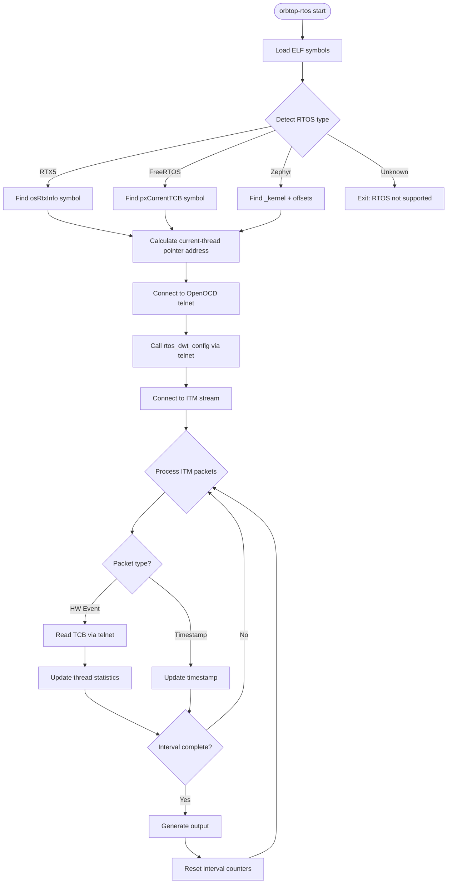

# orbtop-rtos Technical Documentation
## Real-time RTOS Thread Profiling via ITM/DWT for ARM Cortex-M

### Table of Contents

1. [Overview](#overview)
2. [RTOS-specific Target Requirements](#rtos-specific-target-requirements)
3. [Architecture](#architecture)
4. [How It Works](#how-it-works)
5. [Key Components](#key-components)
   - [ITM Configuration Requirements](#1-itm-configuration-requirements)
   - [DWT Configuration via OpenOCD Telnet](#2-dwt-configuration-via-openocd-telnet)
   - [Thread Control Block Structures](#3-thread-control-block-structures)
   - [Memory Reading via Telnet with Caching](#4-memory-reading-via-telnet-with-caching)
6. [Output Formats](#output-formats)
   - [CPU Usage Output — Interval Snapshots](#cpu-usage-output--interval-snapshots)
     - [Console](#console-default)
     - [JSON File](#json-file--j-outputjson)
     - [UDP JSON](#udp-json--j-udpport)
     - [Exception Statistics](#exception-statistics--e)
   - [Ftrace Output](#ftrace-output--k-traceftrace) — see also [Ftrace Output Reference](ftrace/ftrace-output.md)
     - [Thread Context Switches](#thread-context-switches-sched_switch)
     - [Object Tracking Events](#object-tracking-events--w) — [FreeRTOS](freertos/freertos-object-tracking.md) | [RTX5](rtx5/rtx5-object-tracking.md) | [Zephyr](zephyr/zephyr-object-tracking.md)
     - [ITM Stimulus Channels](#itm-stimulus-channels--c)
     - [Combined Example](#combined-example-threads--objects--itm)
     - [Visualization](#visualization)
7. [Usage Examples](#usage-examples)
8. [Thread Switch Detection and Processing](#thread-switch-detection-and-processing)
9. [Adding Support for Other RTOS](#adding-support-for-other-rtos)
10. [Implementation Flow](#implementation-flow)
11. [Technical Details](#technical-details)
12. [ITM Overflow and Its Impact](#itm-overflow-and-its-impact-on-cpu-measurements)
13. [Troubleshooting](#troubleshooting)
14. [Performance Considerations](#performance-considerations)
15. [References](#references)

### Overview

`orbtop-rtos` is a real-time RTOS-aware profiling and tracing tool for ARM Cortex-M targets. Using ITM (Instrumentation Trace Macrocell) and DWT (Data Watchpoint and Trace) hardware, it provides:

- **Per-thread CPU usage** — live statistics updated every configurable interval
- **Thread context switch tracing** — continuous ftrace event stream with microsecond timestamps
- **Kernel object blocking tracking** — which mutex, semaphore, queue, or event each thread is waiting on (`-w`)
- **ITM stimulus channel logging** — firmware-defined counters and signals in the same timeline (`-c`)
- **Exception/IRQ profiling** — entry count, duration, nesting depth (`-E`)

All of this without modifying the target firmware (except optional object tracking hooks).

Supported RTOS:
* **RTX5** (CMSIS-RTOS2): `-T rtx5`
* **FreeRTOS**: `-T freertos`
* **Zephyr**: `-T zephyr`

**Single-core targets only.** SMP/multi-core configurations are not supported.

### RTOS-specific Target Requirements

**RTX5 (CMSIS-RTOS2):**
No special build configuration needed. The `osRtxInfo` structure is always available in RTX5 builds.

**FreeRTOS:**
No special build configuration needed. The `pxCurrentTCB` symbol is always present. Thread names require `configMAX_TASK_NAME_LEN > 0` (default in most ports).

**Zephyr:**
The following Kconfig options must be enabled in `prj.conf`:
```
CONFIG_DEBUG_THREAD_INFO=y   # Required: exports offsets array for debugger tools
CONFIG_THREAD_NAME=y         # Required: enables thread name strings
CONFIG_THREAD_MONITOR=y      # Recommended: enables thread list traversal
```

### Architecture



### How It Works



### Key Components

#### 1. ITM Configuration Requirements

The target must be configured with specific ITM settings:

| Register | Setting | Purpose |
|----------|---------|---------|
| `ITM_TCR.TSENA` | 1 | Enable timestamps for accurate timing |
| `ITM_TCR.DWTENA` | 1 | Route DWT events through ITM |
| `ITM_TCR.SYNCENA` | 1 | Generate SYNC packets for stream sync |
| `DWT_CTRL.CYCCNTENA` | 1 | Enable cycle counter for timestamps |

#### 2. DWT Configuration (via OpenOCD Telnet)

The `rtos_dwt_config` function in `stm32h74x.cfg` configures DWT Comparator 1:

```tcl
proc rtos_dwt_config {address} {
    # Enable trace subsystem
    mmw 0xE000EDFC 0x01000000 0  # DEMCR.TRCENA = 1

    # Unlock ITM and DWT
    mww 0xE0000FB0 0xC5ACCE55     # ITM_LAR unlock
    mww 0xE0001FB0 0xC5ACCE55     # DWT_LAR unlock

    # Enable cycle counter (SYNCTAP configured separately via sync_config)
    mww 0xE0001004 0              # DWT_CYCCNT = 0
    mmw 0xE0001000 0x00000001 0   # DWT_CTRL.CYCCNTENA

    # Enable DWT events, timestamps, SYNC in ITM
    mmw 0xE0000E80 0x0000000E 0   # ITM_TCR: DWTENA | TSENA | SYNCENA

    # Configure DWT Comparator 1
    mww 0xE0001030 $address       # DWT_COMP1 = watch address
    mww 0xE0001034 0x00000000     # DWT_MASK1 = no masking
    mww 0xE0001038 0x0000000D     # DWT_FUNC1 = data write+value

    # Enable SYNC at safe default rate
    sync_config 1
}
```

#### 3. Thread Control Block Structures

Each RTOS has its own TCB layout. The tool reads TCB structures from target memory via OpenOCD telnet:

**RTX5 (CMSIS-RTOS2):**

| Offset (bytes) | Field | Description | Usage |
|----------------|-------|-------------|-------|
| 0x00 | `id` | Object ID (0xF1 = thread) | Validate TCB |
| 0x04 | `name` | Pointer to thread name | Display name |
| 0x20 | `priority` | Thread priority (0-56) | Priority display |
| 0x3C | `thread_addr` | Entry function address | Function name lookup |

**Zephyr:**

Zephyr offsets are **dynamic** — they are read at runtime from the `_kernel_thread_info_offsets` array compiled into the firmware (requires `CONFIG_DEBUG_THREAD_INFO=y`). Legacy Zephyr versions used `_kernel_openocd_offsets` (also supported as fallback). Key offsets include:

| Index | Field | Description |
|-------|-------|-------------|
| 1 | `K_CURR_THREAD` | Offset of `current` in `_cpu` |
| 3 | `T_ENTRY` | Thread entry function offset |
| 7 | `T_PRIO` | Thread priority offset |
| 9 | `T_NAME` | Thread name offset |

**FreeRTOS:**

| Offset (bytes) | Field | Description | Usage |
|----------------|-------|-------------|-------|
| 0x00 | `pxTopOfStack` | Top of stack pointer | Entry function detection |
| 0x2C (44) | `uxPriority` | Task priority | Priority display |
| 0x34 (52) | `pcTaskName` | Task name string (in TCB) | Display name |

FreeRTOS does **not** store the entry function address in the TCB (unlike RTX5 and Zephyr which have dedicated fields). To obtain it, the tool scans the thread's stack looking for `prvTaskExitError`:

1. When FreeRTOS creates a thread, `pxPortInitialiseStack()` sets the initial LR on the stack to `prvTaskExitError` — this is the function that would run if the task's entry function ever returned.
2. The tool finds the `prvTaskExitError` symbol address in the ELF.
3. Starting from `pxEndOfStack`, it scans downward through the stack looking for this address.
4. When found, the word at `addr+4` (immediately above `prvTaskExitError` on the stack) is the entry function's PC.
5. That PC is resolved to a function name via the ELF symbol table.

This works because the initial stack frame laid out by `pxPortInitialiseStack()` places `prvTaskExitError` as LR and the entry function as PC in adjacent stack slots. See the [FreeRTOS Cortex-M4F port](https://github.com/FreeRTOS/FreeRTOS-Kernel/blob/main/portable/GCC/ARM_CM4F/port.c#L205) for the stack layout.

> **Important Note on Priority Changes:**
> Thread priority is only read when a new TCB is first detected (cache miss). If your RTOS supports dynamic priority changes at runtime (priority inheritance, priority ceiling, manual changes), these updates will NOT be reflected in the display. The tool shows the priority at the time the thread was first discovered. To see updated priorities, you would need to restart the monitoring session.

#### 4. Memory Reading via Telnet with Caching

The tool uses OpenOCD's telnet interface with an intelligent cache system:

```c
// From telnet_client.c - Cache structure using uthash
struct memCache {
    uint32_t addr;           // Key: memory address
    uint32_t value;          // Cached value
    uint64_t timestamp;      // When cached
    UT_hash_handle hh;       // Hash table handle
};

uint32_t telnet_read_memory_word(uint32_t address) {
    // First check cache
    struct memCache *cached;
    HASH_FIND_INT(_memCache, &address, cached);
    if (cached) {
        return cached->value;  // Cache hit!
    }
    
    // Cache miss - read from target
    snprintf(cmd, "mdw 0x%08x 1\n", address);
    send(_telnetSocket, cmd, strlen(cmd), 0);
    
    // Parse response and cache it
    if (found) {
        cached = malloc(sizeof(struct memCache));
        cached->addr = address;
        cached->value = value;
        cached->timestamp = genericsTimestampuS();
        HASH_ADD_INT(_memCache, addr, cached);
    }
    return value;
}

// Cache invalidation when thread switches
void telnet_clear_cache_for_tcb(uint32_t tcb_addr) {
    // Clear all cached entries for this TCB (256 byte range)
    HASH_ITER(hh, _memCache, cached, tmp) {
        if (cached->addr >= tcb_addr && 
            cached->addr < (tcb_addr + 256)) {
            HASH_DEL(_memCache, cached);
            free(cached);
        }
    }
}
```

This caching is critical because reading TCB fields (name, priority, function) for each thread switch would otherwise require 3+ telnet round-trips per switch.

**Note:** Cache is cleared ONLY when a NEW TCB is detected (not on every switch to an existing thread). This means thread properties are read once and cached indefinitely.

### Output Formats

`orbtop-rtos` produces two independent categories of output:

1. **CPU Usage** (console, JSON file, or UDP JSON) — periodic snapshots of per-thread CPU% calculated over the `-I` interval
2. **Ftrace** (`-K`) — continuous event stream of context switches, object blocking, and ITM stimulus, written in Linux ftrace text format

These can run simultaneously (e.g., console + ftrace, or UDP JSON + ftrace).

---

#### CPU Usage Output — Interval Snapshots

Every `-I` milliseconds (default 1000), `orbtop-rtos` computes a **snapshot** of per-thread CPU usage for the elapsed interval. Each snapshot contains:

- Per-thread: name, TCB address, entry function, priority, time in ms, CPU%, max CPU%, context switches
- Summary: overall CPU% (excluding idle), max CPU%, CPU frequency, overflow flag

The same data is emitted in all three modes — only the format changes.

##### Console (default)

```
=== RTOS Thread Statistics (rtx5) ===
|----------------|------------|----------------|------------------|----------|-------|-------|----------|
| Thread Name    | Address    | Function       | Priority         | Time(ms) | CPU%  | Max%  | Switches |
|----------------|------------|----------------|------------------|----------|-------|-------|----------|
| main           | 0x20001234 | main_thread    | osPriorityNormal |      451 | 45.123| 48.567|     1234 |
| sensor_task    | 0x20001456 | sensor_loop    | osPriorityHigh   |      234 | 23.456| 25.890|      567 |
|----------------|------------|----------------|------------------|----------|-------|-------|----------|
| idle           | 0x20001000 | os_idle        | osPriorityIdle   |      214 | 21.400| 22.100|     2345 |
|----------------|------------|----------------|------------------|----------|-------|-------|----------|
Interval: 1000 ms, CPU Usage: 78.600%,  Max: 82.345%, CPU Freq: 480000000Hz
```

The summary line appends warnings when data integrity issues are detected:

```
# ITM buffer overflow — packets were lost, CPU% is unreliable
Interval: 1000 ms, CPU Usage: 45.234%, Max: 82.345%, CPU Freq: 480000000Hz [ITM OVERFLOW DETECTED!]

# Total thread time < 95% of window — DWT events were likely lost
Interval: 1000 ms, CPU Usage: 42.100%, Max: 82.345%, CPU Freq: 480000000Hz [WARNING: Low total - possible lost DWT events]

# Total thread time > 105% of window — timestamp accumulation error
Interval: 1000 ms, CPU Usage: 78.600%, Max: 82.345%, CPU Freq: 480000000Hz [WARNING: High total - timing issue?]
```

##### JSON File (`-j output.json`)

Each interval writes one JSON object to the file. The object is a **snapshot** of CPU usage computed over the last `-I` milliseconds.

Each interval produces a **threads object**. When `-E` is also used, a separate **exceptions object** follows.

**Threads object** (every interval):
```json
{
  "threads": [
    {
      "tcb": "0x24006120",
      "name": "producer",
      "func": "task_producer",
      "prio": 24,
      "time_ms": 451,
      "cpu": 45.123,
      "max": 48.567,
      "switches": 1234
    },
    {
      "tcb": "0x24006580",
      "name": "consumer",
      "func": "task_consumer",
      "prio": 24,
      "time_ms": 312,
      "cpu": 31.200,
      "max": 33.100,
      "switches": 987
    },
    {
      "tcb": "0x24006FF0",
      "name": "IDLE",
      "func": "osRtxIdleThread",
      "prio": 1,
      "time_ms": 237,
      "cpu": 23.677,
      "max": 25.400,
      "switches": 2221
    }
  ],
  "interval_ms": 1000,
  "cpu_usage": 76.323,
  "cpu_max": 82.345,
  "cpu_freq": 480000000,
  "overflow": false
}
```

**Exceptions object** (with `-E`, separate JSON object after threads):
```json
{
  "exceptions": [
    {
      "num": 15,
      "name": "SysTick",
      "count": 1000,
      "maxd": 1,
      "total": 1234567,
      "pct": 2.5,
      "ave": 1234,
      "min": 1000,
      "max": 2000,
      "maxwall": 2500
    },
    {
      "num": 37,
      "name": "IRQ 21",
      "count": 500,
      "maxd": 2,
      "total": 567890,
      "pct": 1.2,
      "ave": 1135,
      "min": 900,
      "max": 1500,
      "maxwall": 1800
    }
  ]
}
```

**JSON contract — thread fields:**

| Field | Type | Description |
|-------|------|-------------|
| `tcb` | string | TCB address as hex `"0xNNNNNNNN"` |
| `name` | string | Thread name from RTOS, or `"unknown"` |
| `func` | string | Entry function name (from ELF symbols), or `"unknown"` |
| `prio` | int | Priority (RTOS-specific scale) |
| `time_ms` | int | CPU time in this interval (milliseconds) |
| `cpu` | float | CPU% in this interval (0.000–100.000) |
| `max` | float | Peak CPU% seen across all intervals |
| `switches` | int | Context switches in this interval |

**JSON contract — summary fields:**

| Field | Type | Description |
|-------|------|-------------|
| `interval_ms` | int | Reporting interval in ms (from `-I`) |
| `cpu_usage` | float | Overall CPU% excluding idle thread |
| `cpu_max` | float | Peak overall CPU% across all intervals |
| `cpu_freq` | int | CPU frequency in Hz (from `-F`), omitted if 0 |
| `overflow` | bool | `true` if ITM overflow was detected in this interval |

##### UDP JSON (`-j udp:port`)

Same JSON contract as file mode. One JSON object per line, sent as UDP datagram every `-I` interval:

```bash
$ nc -lu 46006
{"threads":[{"tcb":"0x24006120","name":"producer",...},{"tcb":"0x24006580","name":"consumer",...},...],"interval_ms":1000,"cpu_usage":78.600,...}
{"threads":[{"tcb":"0x24006120","name":"producer",...},{"tcb":"0x24006580","name":"consumer",...},...],"interval_ms":1000,"cpu_usage":79.557,...}
```

Console output is suppressed when using UDP mode.

##### Exception Statistics (`-E`)

When exception tracking is enabled, exception data is reported alongside thread data.

**Console:**

```
=== Exception Statistics ===
|-------------------|----------|-------|-------------|-------|------------|------------|------------|------------|
| Exception         |   Count  | MaxD  | TotalTicks  |   %   |  AveTicks  |  minTicks  |  maxTicks  |  maxWall   |
|-------------------|----------|-------|-------------|-------|------------|------------|------------|------------|
| 15 (SysTick)      |     1000 |     1 |    1234567  |  2.5  |       1234 |       1000 |       2000 |       2500 |
| 37 (IRQ 21)       |      500 |     2 |     567890  |  1.2  |       1135 |        900 |       1500 |       1800 |
|-------------------|----------|-------|-------------|-------|------------|------------|------------|------------|
```

**JSON file / UDP** — separate JSON object emitted after the threads object each interval. See the exceptions example in the [JSON File](#json-file--j-outputjson) section above.

**UDP** — additionally, each exception is sent as an individual object with an `"ex":1` marker to distinguish from thread data:

```json
{"ex":1,"num":15,"name":"SysTick","count":1000,"maxd":1,"total":1234567,"pct":2.5,"ave":1234,"min":1000,"max":2000,"maxwall":2500}
```

---

#### Ftrace Output (`-K trace.ftrace`)

The `-K` option writes a continuous event stream in Linux kernel ftrace text format. This file can be opened in [Perfetto](https://ui.perfetto.dev) or Eclipse TraceCompass.  See **[Ftrace Output Reference](ftrace/ftrace-output.md)** for the full format specification, real examples from all three RTOS plugins, firmware hooks, and Perfetto visualization guide.

Unlike CPU usage output (which is periodic snapshots), ftrace captures **every individual event** as it happens — every context switch, every object block/unblock, every ITM stimulus write.

##### Header

Written once on the first context switch:

```
# tracer: nop
#
# entries-in-buffer/entries-written: 0/0   #P:1
#
#                                _-----=> irqs-off
#                               / _----=> need-resched
#                              | / _---=> hardirq/softirq
#                              || / _--=> preempt-depth
#                              ||| /     delay
#           TASK-PID     CPU#  ||||   TIMESTAMP  FUNCTION
#              | |         |   ||||      |         |
```

##### Thread Context Switches (`sched_switch`)

Every context switch generates a `sched_switch` event:

```
mutexA|task_mutex_a-604019640 [000] ....  1668.583580: sched_switch: prev_comm=mutexA|task_mutex_a prev_pid=604019640 prev_prio=24 prev_state=R ==> next_comm=autotestTask|autotest_task next_pid=604032448 next_prio=25
```

Format: `name|entry_func-PID [CPU] .... TIMESTAMP: sched_switch: prev_comm=... prev_pid=PID prev_prio=PRIO prev_state=STATE ==> next_comm=... next_pid=PID next_prio=PRIO`

| Field | Value |
|-------|-------|
| `name\|entry_func` | Thread name + entry function, or just name if entry unknown |
| PID | TCB address cast to `uint32_t` |
| CPU | Always `000` (single-core) |
| TIMESTAMP | Seconds since first event, 6 decimal places (microsecond precision) |
| `prev_state` | `R` = runnable (preempted), `S` = sleeping (delay/wakeup), `D` = blocked on object |

Without object tracking (`-w`), you only see `prev_state=R` and `prev_state=S`.

**Real examples (FreeRTOS, all three states):**

```
mutexA|task_mutex_a-604019640 [000] ....     0.017183: sched_switch: ... prev_state=R ==> next_comm=mutexB|task_mutex_b next_pid=604021104 next_prio=24
blinkTask|blink_task-604027912 [000] ....   614.533882: sched_switch: ... prev_state=S ==> next_comm=mutexA|task_mutex_a next_pid=604019640 next_prio=24
mutexB|task_mutex_b-604021104 [000] ....   614.510154: sched_switch: ... prev_state=D ==> next_comm=semWait|task_sem_wait next_pid=604022568 next_prio=24
```

##### Object Tracking Events (`-w`)

When object tracking is enabled with `-w rtos_obj_trace`, two additional behaviors appear:

1. **`prev_state=D`** in `sched_switch` — the outgoing thread is blocked on a kernel object
2. **`tracing_mark_write`** counter events — mark when a thread starts and stops blocking on a specific object

```
        rtos_obj-1 [000] ....   614.512741: tracing_mark_write: C|1|sem:TestSem|1
semWait|task_sem_wait-604022568 [000] ....   614.516284: sched_switch: prev_comm=semWait|task_sem_wait prev_pid=604022568 prev_prio=24 prev_state=D ==> next_comm=bsemWait|task_bsem_wait next_pid=604024032 next_prio=24
        rtos_obj-1 [000] ....   614.516284: tracing_mark_write: C|1|sem:TestSem|0
```

The counter track format is `C|1|type_prefix:object_name|flag`:

| Part | Description |
|------|-------------|
| `C` | Counter event |
| `1` | Counter group (always 1 for object tracking) |
| `type_prefix:object_name` | e.g., `mutex:TestMutex`, `sem:TestSem`, `msgqueue:CmdQueue`, `evtflags:0x20001234` |
| `1` | Thread begins blocking on this object |
| `0` | Thread stops blocking (unblocked or switched away) |

In Perfetto, these render as named counter tracks aligned with the thread timeline, showing exactly which object each thread is waiting on.

See per-RTOS details: [FreeRTOS](freertos/freertos-object-tracking.md) | [RTX5](rtx5/rtx5-object-tracking.md) | [Zephyr](zephyr/zephyr-object-tracking.md)

##### ITM Stimulus Channels (`-c`)

When ITM channel logging is enabled with `-c`, firmware writes to ITM stimulus ports appear as additional counter tracks:

```
           <...>-0 [000] ....  1094.505372: tracing_mark_write: C|0|signal_1|45
           <...>-0 [000] ....  1094.505667: tracing_mark_write: C|0|signal_2|207
           <...>-0 [000] ....  1094.505954: tracing_mark_write: C|0|signal_3|70
```

The format is `C|0|tag_name|value`:

| Part | Description |
|------|-------------|
| `C` | Counter event |
| `0` | Counter group (always 0 for ITM stimulus) |
| `tag_name` | Tag from `-c` option (e.g., `-c 1-31:signal_` generates `signal_1` through `signal_31`) |
| `value` | 32-bit value written by firmware to the ITM stimulus port |

In Perfetto, each tagged channel renders as a separate counter track.

##### Combined Example (threads + objects + ITM)

A real FreeRTOS trace showing all three event types together. Sequence:
mutex acquire, D-state context switch, semaphore acquire, release, ITM burst.

```
# tracer: nop
#
# entries-in-buffer/entries-written: 0/0   #P:1
#
#                                _-----=> irqs-off
#                               / _----=> need-resched
#                              | / _---=> hardirq/softirq
#                              || / _--=> preempt-depth
#                              ||| /     delay
#           TASK-PID     CPU#  ||||   TIMESTAMP  FUNCTION
#              | |         |   ||||      |         |
         unknown-0 [000] ....     0.000000: sched_switch: prev_comm=unknown prev_pid=0 prev_prio=0 prev_state=R ==> next_comm=mutexA|task_mutex_a next_pid=604019640 next_prio=24
        rtos_obj-1 [000] ....   614.506031: tracing_mark_write: C|1|mutex:TestMutex|1
mutexB|task_mutex_b-604021104 [000] ....   614.510154: sched_switch: prev_comm=mutexB|task_mutex_b prev_pid=604021104 prev_prio=24 prev_state=D ==> next_comm=semWait|task_sem_wait next_pid=604022568 next_prio=24
        rtos_obj-1 [000] ....   614.510154: tracing_mark_write: C|1|mutex:TestMutex|0
        rtos_obj-1 [000] ....   614.512741: tracing_mark_write: C|1|sem:TestSem|1
semWait|task_sem_wait-604022568 [000] ....   614.516284: sched_switch: prev_comm=semWait|task_sem_wait prev_pid=604022568 prev_prio=24 prev_state=D ==> next_comm=bsemWait|task_bsem_wait next_pid=604024032 next_prio=24
        rtos_obj-1 [000] ....   614.516284: tracing_mark_write: C|1|sem:TestSem|0
producer|task_producer-604026960 [000] ....   614.528683: sched_switch: prev_comm=producer|task_producer prev_pid=604026960 prev_prio=24 prev_state=S ==> next_comm=blinkTask|blink_task next_pid=604027912 next_prio=24
           <...>-0 [000] ....  1094.505372: tracing_mark_write: C|0|signal_1|45
           <...>-0 [000] ....  1094.505667: tracing_mark_write: C|0|signal_2|207
```

##### Visualization

Open the `.ftrace` file in:

- **[Perfetto](https://ui.perfetto.dev)** — drag and drop the file. Thread timeline, object counter tracks, and ITM counters all appear as separate tracks.
- **Eclipse TraceCompass** — File > Open Trace, select file, choose "ftrace" type. Install "Trace Compass ftrace (Incubation)" plugin if needed.

### Usage Examples

#### Prerequisites: OpenOCD Configuration

Use the provided `stm32h74x.cfg` from the project. Key parts for ITM/DWT configuration:

```tcl
# From stm32h74x.cfg - ITM configuration in examine-end event
$_CHIPNAME.cpu0 configure -event examine-end {
    # Enable clock for tracing
    # DBGMCU_CR |= TRACECLKEN
    stm32h7x_dbgmcu_mmw 0x004 0x00100000 0

    # Configure ITM with SYNC packets enabled
    mww 0xE0000E80 0x0001000F   ;# TCR: enable ITM with TraceBusID=1, SYNCENA=1, TSENA=1
    mww 0xE0000E00 0x00000001   ;# TER: enable ITM channel 0
}

# DWT registers for RTOS monitoring (defined in file)
set DWT_CTRL    0xE0001000
set DWT_CYCCNT  0xE0001004
set DWT_COMP1   0xE0001030
set DWT_MASK1   0xE0001034
set DWT_FUNC1   0xE0001038

# DWT configuration function for RTOS
proc rtos_dwt_config {address} {
    # Enable trace in DEMCR
    mmw 0xE000EDFC 0x01000000 0  # DEMCR.TRCENA = 1

    # Unlock ITM and DWT
    mww 0xE0000FB0 0xC5ACCE55     # ITM_LAR unlock
    mww 0xE0001FB0 0xC5ACCE55     # DWT_LAR unlock

    # Enable cycle counter (SYNCTAP configured separately via sync_config)
    mww 0xE0001004 0              # DWT_CYCCNT = 0
    mmw 0xE0001000 0x00000001 0   # DWT_CTRL.CYCCNTENA

    # Enable DWT events, timestamps, SYNC in ITM
    mmw 0xE0000E80 0x0000000E 0   # ITM_TCR: DWTENA | TSENA | SYNCENA

    # Configure DWT Comparator 1 for data write+value tracking
    mww 0xE0001030 $address       # DWT_COMP1 = watch address
    mww 0xE0001034 0x00000000     # DWT_MASK1 = no masking
    mww 0xE0001038 0x0000000D     # DWT_FUNC1 = data write+value

    # Enable SYNC at safe default rate
    sync_config 1
}

# Exception trace functions
proc exception_trace_enable {} {
    echo "DWT: enabling exception trace"
    mmw 0xE000EDFC 0x01000000 0  # DEMCR.TRCENA
    mmw 0xE0001000 0x00001000 0  # DWT_CTRL.EXCTRCENA
}
```

Start OpenOCD with the provided cfg file:
```bash
openocd -f openocd/stm32h74x.cfg
```

**THAT'S IT!** The cfg file automatically does EVERYTHING:
- Configures ITM with timestamps and SYNC packets
- Enables trace clocks
- Creates SWO object and configures it
- Outputs ITM stream on TCP port 46000

From the cfg file:
```tcl
# Line 212-213: ITM auto-configured in examine-end event
mww 0xE0000E80 0x0001000F   ;# TCR: enable ITM with TraceBusID=1, SYNCENA=1, TSENA=1

# Line 335-336: SWO auto-configured and enabled
$_CHIPNAME.swo configure -protocol uart -traceclk 480000000 -pin-freq 4000000 -formatter on -output :46000
$_CHIPNAME.swo enable
```

**THAT'S ALL!** OpenOCD is ALREADY serving the ITM stream on port 46000!

The data flow is simply:
- **OpenOCD port 46000**: ITM stream ready to use
- **OpenOCD port 4444**: Telnet for memory reads and DWT config
- **orbtop-rtos**: Connects DIRECTLY to OpenOCD port 46000

**No manual telnet commands needed for ITM!** Everything is automatic when you start OpenOCD with the cfg.

**BUT THE MAGIC IS:** The cfg file defines helper functions that orbtop-rtos WILL USE via telnet:

```tcl
# These functions are available via telnet for orbtop-rtos to call:
proc rtos_dwt_config {address}    # Configure DWT comp1 for thread switch detection
proc rtos_dwt2_config {address}   # Configure DWT comp2 for object tracking (-w)
proc exception_trace_enable {}     # Enable exception tracing (-E option)
proc pc_sampling_config {freq}     # PC sampling rate (0=off, 1/6/24 Hz)
proc sync_config {rate}            # SYNC packet rate (0=off, 1/6/24 Hz)
```

When orbtop-rtos starts, it:
1. Connects to OpenOCD telnet (port 4444)
2. Finds the osRtxInfo symbol address
3. Calls `rtos_dwt_config 0xXXXXXXXX` via telnet to configure DWT Comparator 1
4. The DWT then monitors that address for thread switches!

So the cfg provides both:
- **Automatic ITM/SWO setup** when OpenOCD starts
- **Helper functions** that orbtop-rtos calls via telnet

#### Basic RTOS Monitoring
```bash
# RTX5 example
orbtop-rtos \
  -s localhost:46000 \
  -p ITM \
  -e firmware.elf \
  -T rtx5 \
  -W 4444 \
  -F 480000000 \
  -I 1000

# FreeRTOS example
orbtop-rtos \
  -s localhost:46000 \
  -p ITM \
  -e firmware.elf \
  -T freertos \
  -W 4444 \
  -F 480000000 \
  -I 1000

# Zephyr example
orbtop-rtos \
  -s localhost:46000 \
  -p ITM \
  -e firmware.elf \
  -T zephyr \
  -W 4444 \
  -F 480000000 \
  -I 1000
```

#### JSON UDP Output (No Console)
```bash
orbtop-rtos \
  -s localhost:46000 \
  -p ITM \
  -e firmware.elf \
  -T freertos \
  -W 4444 \
  -F 480000000 \
  -j udp:46006          # JSON via UDP, console disabled

# Receive JSON in another terminal
nc -lu 46006
```

#### With Exception Tracking
```bash
orbtop-rtos \
  -s localhost:46000 \
  -p ITM \
  -e firmware.elf \
  -T zephyr \
  -W 4444 \
  -F 480000000 \
  -E                    # Enable exception statistics
```

#### Ftrace with Object Tracking and ITM Channels
```bash
orbtop-rtos \
  -s localhost:46000 \
  -p ITM \
  -e firmware.elf \
  -T freertos \
  -W 4444 \
  -F 480000000 \
  -w rtos_obj_trace \
  -c 1-31:signal_ \
  -K trace.ftrace       # sched_switch + tracing_mark_write

# Open with Perfetto (recommended): https://ui.perfetto.dev — drag and drop
# Perfetto natively understands sched_switch + tracing_mark_write counter tracks.
#
# TraceCompass: File -> Open Trace (needs ftrace plugin). Shows sched_switch
# timeline but does NOT parse tracing_mark_write events without a custom XML
# analysis module. TraceCompass is extensible — a custom XML definition can
# be written to extract the counter tracks.
```

### Thread Switch Detection and Processing

When a new TCB is detected via DWT:

```c
// From rtos_support.c - Thread switch handling
void rtosHandleDWTMatchWithTimestamp(..., uint32_t value, 
                                     uint64_t itm_timestamp, ...) {
    // value = new TCB address that was written
    
    // 1. Check if this is a new thread
    struct rtosThread *thread;
    HASH_FIND_INT(rtos->threads, &value, thread);
    
    if (!thread) {
        // New thread! Allocate and add to hash
        thread = calloc(1, sizeof(struct rtosThread));
        thread->tcb_addr = value;
        HASH_ADD_INT(rtos->threads, tcb_addr, thread);
        
        // Clear cache for this TCB range
        rtosClearMemoryCacheForTCB(value);
    }
    
    // 2. Read thread info from target (uses cache)
    rtos->ops->read_thread_info(rtos, symbols, thread, value);
    
    // 3. Update timing for previous thread
    if (rtos->current_thread && rtos->current_thread != value) {
        struct rtosThread *prev;
        HASH_FIND_INT(rtos->threads, &rtos->current_thread, prev);
        if (prev) {
            // Calculate how long previous thread ran
            uint64_t delta = itm_timestamp - rtos->last_switch_time;
            prev->accumulated_time_us += delta;
            prev->accumulated_cycles += delta * cpu_freq / 1000000;
        }
    }
    
    // 4. Switch to new thread
    rtos->current_thread = value;
    rtos->last_switch_time = itm_timestamp;
    thread->context_switches++;
    thread->window_switches++;
}
```

### Adding Support for Other RTOS

The RTOS support is modular via the `rtosOps` interface. Each RTOS backend (RTX5, FreeRTOS, Zephyr) implements this interface and is registered in `rtos_api.c`:

```c
struct rtosOps {
    int (*read_thread_info)(...);       // Read TCB fields from target memory
    int (*init)(...);                   // Find current-thread pointer symbol
    const char* (*get_priority_name)(); // Human-readable priority name
    bool (*is_idle_thread)(...);        // Identify idle thread for CPU% calc
    uint32_t (*get_watchpoint_addr)();  // Address to watch for context switches
    int (*verify_target_match)(...);    // Verify RTOS is running on target
    void (*cleanup)(...);               // Free RTOS-specific resources
};
```

To add a new RTOS backend:
1. Create `Inc/rtos/<name>/<name>.h` and `Src/rtos/<name>/<name>.c`
2. Implement the `rtosOps` interface
3. Register it in the `rtos_registry[]` array in `rtos_api.c`
4. Add the source to `meson` (orbtop-rtos target)

Each RTOS watches a different symbol for context switches:
* **RTX5**: `osRtxInfo.thread.run.curr`
* **FreeRTOS**: `pxCurrentTCB`
* **Zephyr**: `_kernel` + dynamic offset from `_kernel_thread_info_offsets`

### Implementation Flow



### Technical Details

#### DWT Comparator Configuration

The DWT comparator monitors writes to the current-thread pointer (RTX5: `osRtxInfo.thread.run.curr`, FreeRTOS: `pxCurrentTCB`, Zephyr: `_kernel` + dynamic offset):

- **DWT_COMP1**: Set to address of current thread pointer
- **DWT_MASK1**: 0x00000000 (no masking, exact match)
- **DWT_FUNC1**: 0x00000814
    - Bits 0-3: 0x4 = Generate watchpoint debug event
    - Bit 4: 1 = EMITRANGE
    - Bits 10-11: 0x2 = Data write of size 4 bytes

#### ITM Timestamp Handling

ITM timestamps are **incremental**, not absolute. The tool accumulates them to track real time:

```c
// From orbtop_rtos.c - Timestamp handling
struct TSMsg {
    uint32_t timeInc;    // Incremental timestamp from ITM
    enum timeDelay timeStatus;
};

void _handleTS(struct TSMsg *m, struct ITMDecoder *i) {
    // Accumulate incremental timestamps
    _r.timeStamp += m->timeInc;
}

// When DWT event arrives with thread switch
void _handleDataAccessWP(struct wptMsg *m, struct ITMDecoder *i) {
    // Use accumulated timestamp for thread timing
    rtosHandleDWTMatchWithTimestamp(_r.rtos, _r.s, 
                                    m->comp, 0, m->data, 
                                    _r.timeStamp,  // Accumulated!
                                    options.telnetPort);
}
```

The ITM generates timestamp packets:
- Local timestamps: Small increments between packets
- Global timestamps: Periodic full timestamp sync
- Prescaler affects resolution (typically /4 or /16 of CPU clock)

The accumulated `_r.timeStamp` is in **raw CPU clock ticks** (affected by prescaler). For
ftrace output and per-thread time accounting, ticks are converted to microseconds using the
CPU frequency specified with `-F`:

```c
// ticks_to_us() in rtos_support.h
uint64_t us = ticks / (cpu_freq / 1000000);
```

This produces the standard ftrace `seconds.microseconds` timestamp format (6 decimal places).
- Window-based statistics reset every interval

#### Thread Statistics Calculation

```c
// Per thread, per interval:
cpu_percent = (accumulated_time_us * 100.0) / window_time_us;
accumulated_cycles = (accumulated_time_us * cpu_freq) / 1000000;
```

### ITM Overflow and Its Impact on CPU Measurements

#### The Problem
When ITM overflow occurs, packets are LOST, including:
- **HW packets**: Thread switch events from DWT
- **Timestamp packets**: Relative timing information

Since ITM timestamps are **incremental** (not absolute), losing packets means:
1. **Lost thread switches**: The tool doesn't know a thread ran
2. **Lost time intervals**: Can't calculate how long threads executed
3. **Incorrect CPU percentages**: Missing data leads to wrong calculations

#### How It Shows in Output
```
Interval: 1000 ms, CPU Usage: 78.600%,  Max: 82.345%, CPU Freq: 480000000Hz [ITM OVERFLOW DETECTED!]
```

Or when total doesn't add up to ~100%:
```
Interval: 1000 ms, CPU Usage: 45.234%,  Max: 82.345%, CPU Freq: 480000000Hz [WARNING: Low total - possible lost DWT events]
```

#### Why This Happens
- **Too much ITM traffic**: Exception trace + thread switches + SW packets
- **SWO bandwidth limit**: Pin frequency too low for the amount of ITM traffic
- **Buffer overruns**: ITM internal buffers overflow

#### Solutions
1. **Reduce ITM traffic**:
    - Disable exception trace if not needed (don't use `-E`)
    - Disable SW ITM output in firmware (reduce stimulus port writes)

2. **Increase SWO pin frequency** (in cfg file):
   ```tcl
   # Increase -pin-freq (max depends on MCU and debug probe, typically 2-12+ MHz)
   $_CHIPNAME.swo configure -protocol uart -traceclk 480000000 -pin-freq 4000000
   ```

3. **Monitor overflow counter**: Watch the `Ovf` counter in output

**IMPORTANT**: When overflow occurs, data is lost. CPU usage percentages become unreliable, and ftrace output will have missing context switches and object events.

### Troubleshooting

| Issue | Cause | Solution |
|-------|-------|----------|
| No thread data | DWT not configured | Verify telnet connection and osRtxInfo symbol |
| Wrong thread names | Memory cache stale | Tool auto-clears cache on thread switch |
| Missing timestamps | ITM timestamps disabled | Set ITM_TCR.TSENA=1 in target config |
| High CPU usage shown | Interval too short | Increase -I parameter (default 1000ms) |
| ITM OVERFLOW warning | Too much ITM traffic | Reduce traffic or increase SWO bandwidth |
| Low CPU total (<95%) | Lost DWT events/overflow | Check for overflow, reduce ITM load |

### Performance Considerations

- **Memory caching**: Reduces telnet round-trips
- **Batch telnet commands**: Multiple reads in single transaction
- **UDP mode**: Eliminates console rendering overhead
- **DWT overhead**: Single comparator has minimal target impact

### References

- [RTX5 CMSIS-RTOS2](https://arm-software.github.io/CMSIS_5/RTOS2/html/)
- [FreeRTOS Documentation](https://www.freertos.org/Documentation/RTOS_book.html)
- [Zephyr Thread Info Debug](https://docs.zephyrproject.org/latest/services/debugging/thread-analyzer.html)
- [ARM DWT Programming](https://developer.arm.com/documentation/ddi0403/e/)
- [Orbuculum Documentation](https://github.com/orbcode/orbuculum)